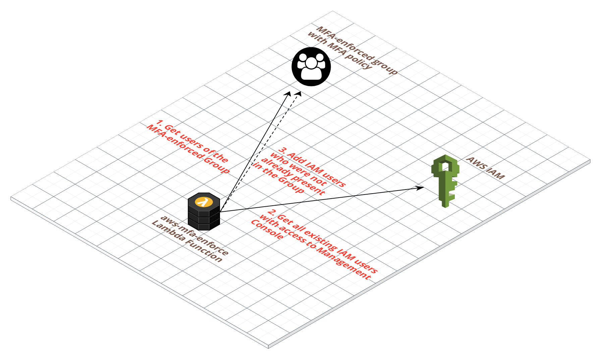

# aws-mfa-enforce

[](http://www.serverless.com)

Serverless function to automate enforcement of Multi-Factor Authentication (MFA) to all AWS IAM users with access to AWS Management Console.

## How to use it ?

Enforcing MFA to IAM users was a manual task. But now all you have to do is, setup [Serverless Framework](https://serverless.com) and run the command:

```bash
git clone https://github.com/Chan9390/aws-mfa-enforce
cd aws-mfa-enforce
# execute awscli commands to configure email notifications
sls deploy
```

To add email notification feature, edit `serverless.js` to set the email subject and body. Also ***execute the following commands before deploying***:

```
aws ssm put-parameter --name email --type String --value yourmail@gmail.com --region us-east-1
aws ssm put-parameter --name email_password --type String --value your_password --region us-east-1
```

(Don't forget to [allow insecure apps](https://myaccount.google.com/lesssecureapps) to access your Gmail account. This setup will not work otherwise.)

## How does it work ?

This serverless function creates an IAM Group called `MFA-enforced` with an inline policy which denies access to all AWS services until the IAM user activate MFA. It also has a lambda function which acts as a cron (for every 12 hours) to check for new IAM users and add it to the group.



It can also send emails to the IAM user accounts if the IAM usernames is a valid email ID. But this is optional feature.

## Pre-Requisites

- an AWS account and access keys must be setup under the default profile within `~/.aws/credentials`
- awscli (optional). Required only if email notification feature is used.
- Serverless Framework installed and setup on your machine - https://serverless.com/framework/docs/providers/aws/guide/installation/

## How to remove it (if necessary) ?

Goto https://console.aws.amazon.com/iam/home?#/groups/MFA-enforced and remove all users from the group. Then to remove the complete serverless function execute `sls remove`.

----

### References

- Tutorial: Enable Your Users to Configure Their Own Credentials and MFA Settings - https://docs.aws.amazon.com/IAM/latest/UserGuide/tutorial_users-self-manage-mfa-and-creds.html
- Enabling a Virtual Multi-Factor Authentication (MFA) Device (Console) - https://docs.aws.amazon.com/IAM/latest/UserGuide/id_credentials_mfa_enable_virtual.html